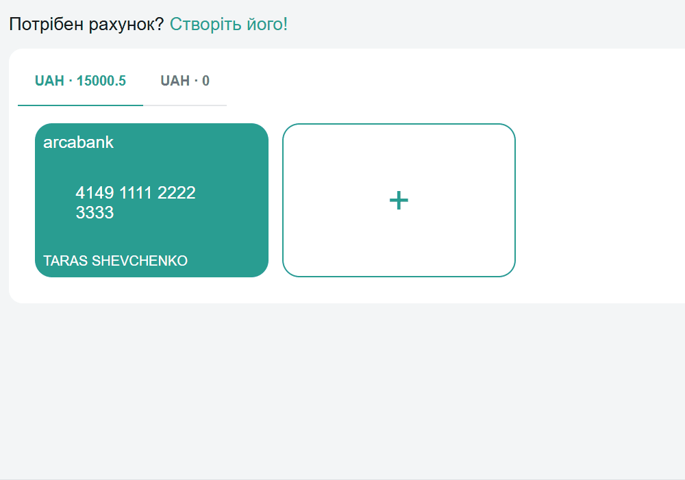
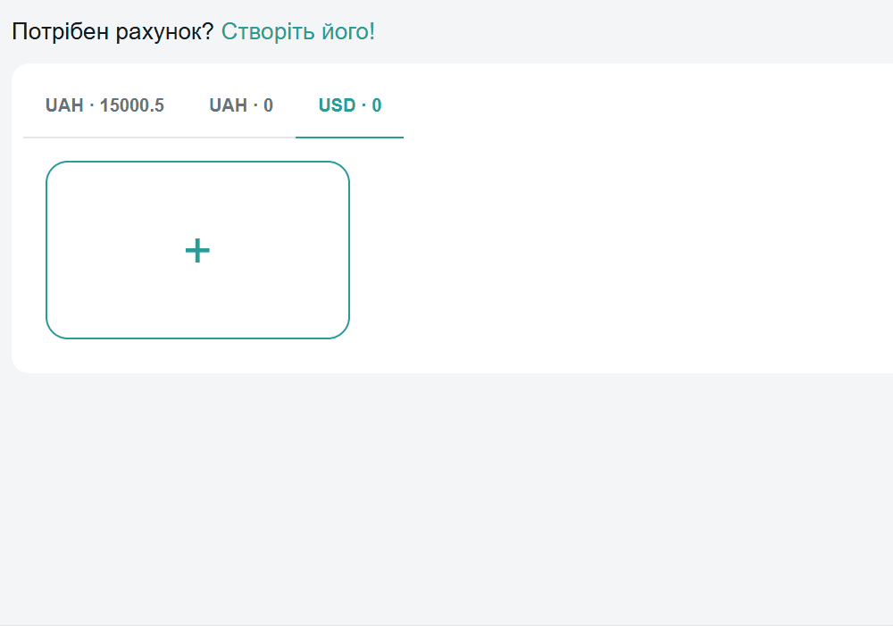
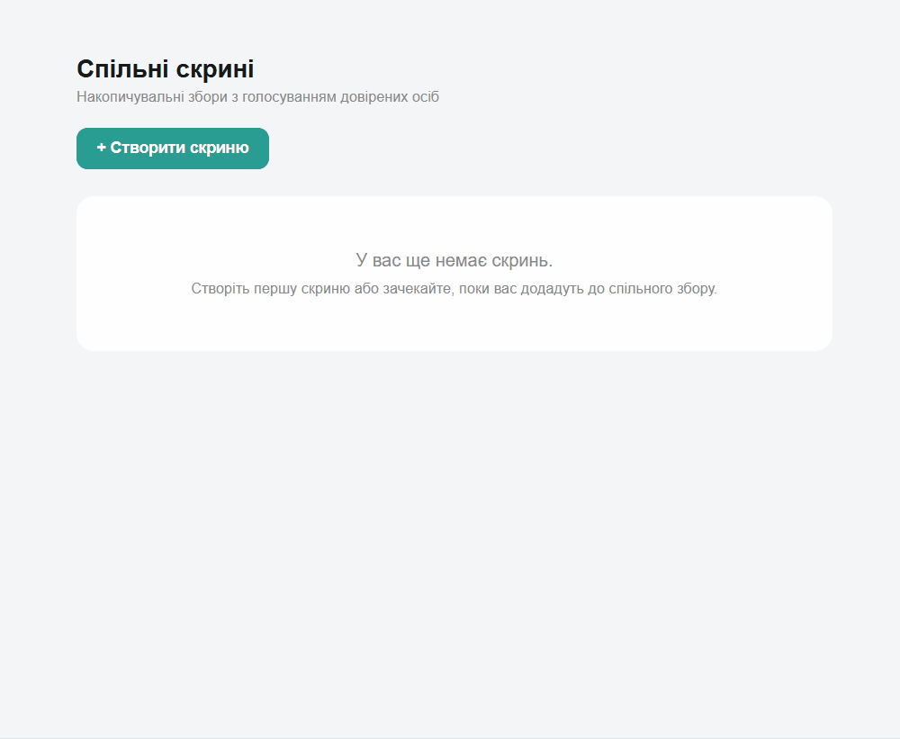
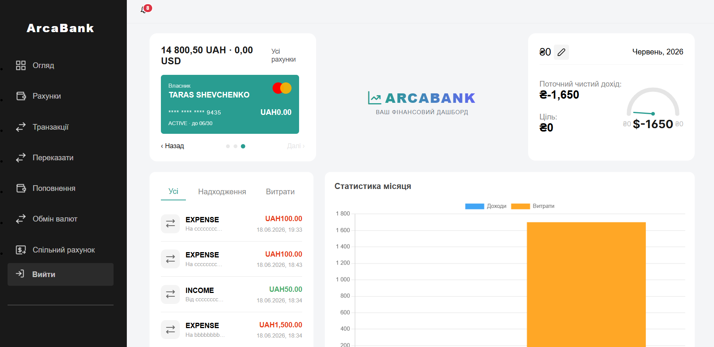
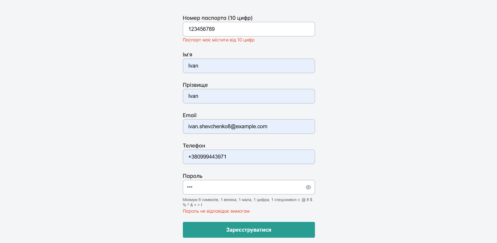
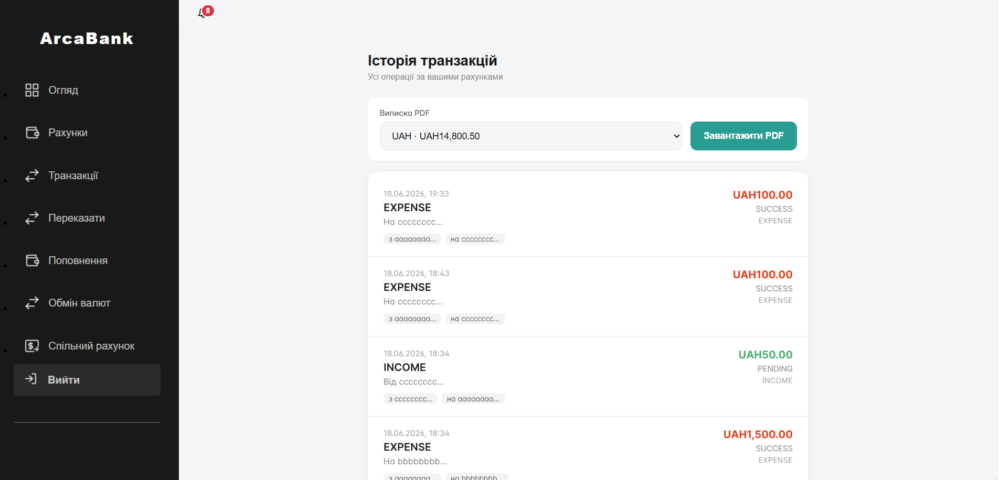

### ArcaBank - Your space, common rules.

An online banking system that allows users to manage accounts, make P2P transfers, and create shared "vaults" with an Escrow voting mechanism for secure fund withdrawals.

## 🛠 Tech Stack


## 🛠 Getting Started

### 1. Prerequisites
Ensure you have the following installed on your local machine:
- [Docker](https://docs.docker.com/get-docker/) & [Docker Compose](https://docs.docker.com/compose/install/) (Recommended for full stack execution)
- `Java 21` (For local backend development)
- `Node.js` (v18+) & Angular CLI (`npm install -g @angular/cli`) (For local frontend development)
- `Maven 3.8+` (For building backend services)

### 2. Installation & Running (Docker Way - Recommended)
The easiest way to start the entire infrastructure (Databases, Message Brokers, Keycloak, and all Microservices) is using Docker Compose.

1. Clone the repository:
   ```bash
   git clone https://github.com/Darmohrai/ArcaBank.git
   cd arcabank
   ```
2. Set up environment variables:
   ```bash
   cp .env.example .env
   ```
3. Build and start the entire system:
   ```bash
   docker-compose up -d --build
   ```
*Note: On the first run, the `init-dbs.sh` script will automatically create isolated databases for each microservice.*

### 3. Local Development (Running without Docker)
If you prefer to run services individually via your IDE or terminal for debugging:

1. Start only the foundational infrastructure (DBs, Kafka, Keycloak):
   ```bash
   docker-compose up -d postgres zookeeper kafka keycloak
   ```
2. Build the shared gRPC contracts first:
   ```bash
   cd server
   mvn clean install -pl common-proto -am -DskipTests
   ```
3. Start the Backend microservices (run each in a separate terminal or via IDE):
   ```bash
   mvn spring-boot:run -pl core-finance
   mvn spring-boot:run -pl auth-service
   # ... run other services similarly
   ```
4. Start the Frontend:
   ```bash
   cd ../client
   npm install
   ng serve


### API Documentation (Swagger)
Once the system is running, explore and test the endpoints via Swagger UI:

Core Finance Service: http://localhost:8088/swagger-ui/index.html#/

Auth Service: http://localhost:8081/swagger-ui/index.html#/

Frontend Application
URL: http://localhost:4200

#### Test Credentials
Watch arcabank-realm in deploy.

#

## For User

#### Create account


#### Create card


#### Create arca


#### Main screen


#### Register screen


#### Transaction history screen


#### Video
https://youtu.be/739LhN-NiTU


## 🚀 Marketing Kit & Strategy
[tap here to see more](docs/marketing)

[tap here to see notion](https://app.notion.com/p/ArcaBank-Project-324fd27e06318077b087e546f5e0810c)
